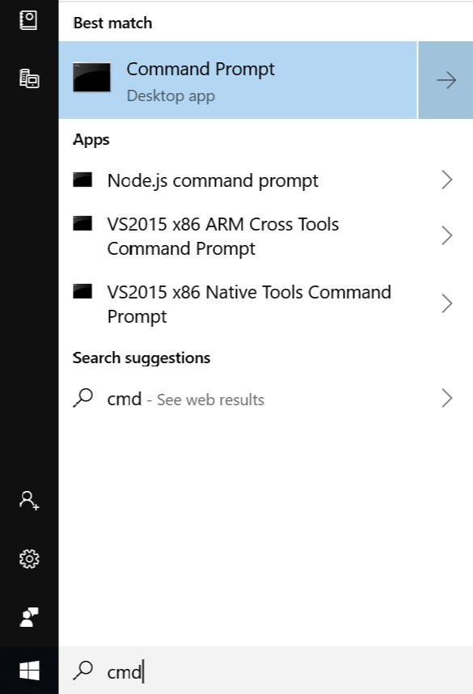
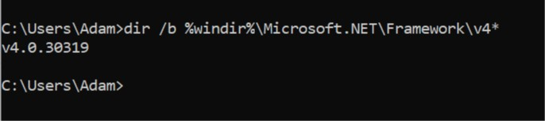

# WhatsHappeningHere
*What's Happening Here?* is a map-based web app designed to display live traffic data and points-of-interest markers in a local area.

## Getting Started
This section goes over how to install a working version of *What's Happening Here?* as well as how to get the source code to examine it in your own local IDE.

### Prerequisites
*What's Happening Here?* is designed with Microsoft Windows in mind and requires the .NET Framework version 4.0 to run.
Also, as a web app, it requires access to the internet.

#### But Do I Have .NET Framework 4.0 Installed?
If you are running Microsoft Windows and are unsure whether or not .NET Framework 4.0 is installed, you can easily check with a command prompt:
Open a command prompt. Search for `cmd` in the start menu and select `command prompt`.


Run the following command:
```
dir /b %windir%\Microsoft.NET\Framework\v4*
```
If anything like the following is displayed, then you have .NET Framework version 4.0 installed.
If not, you will have to install it.


#### Installing .NET Framework 4.0
You can download the installation media from the Microsoft Download Center:

[.NET Framework 4.0 download page](https://www.microsoft.com/en-us/download/details.aspx?id=17851)

Follow the instructions on that page. If you do not meet the system, software, and hardware requirements, then you unfortunately
cannot install .NET Framework 4.0

#### But I Don't Have Windows!
That does make things trickier, but all is not lost.  If you are running Linux or Mac OS X, then your best bet is
[Mono Runtime for Mac](https://www.mono-project.com/download/stable/#download-mac) or
[Mono Runtime for Linux](https://www.mono-project.com/download/stable/#download-lin)

Be sure to look at Mono's helpful [documentation page](https://www.mono-project.com/docs/advanced/runtime/)

### Installation
This section covers how to install the application or download the source code.

#### Get the App
TODO

#### Get the Source
TODO
