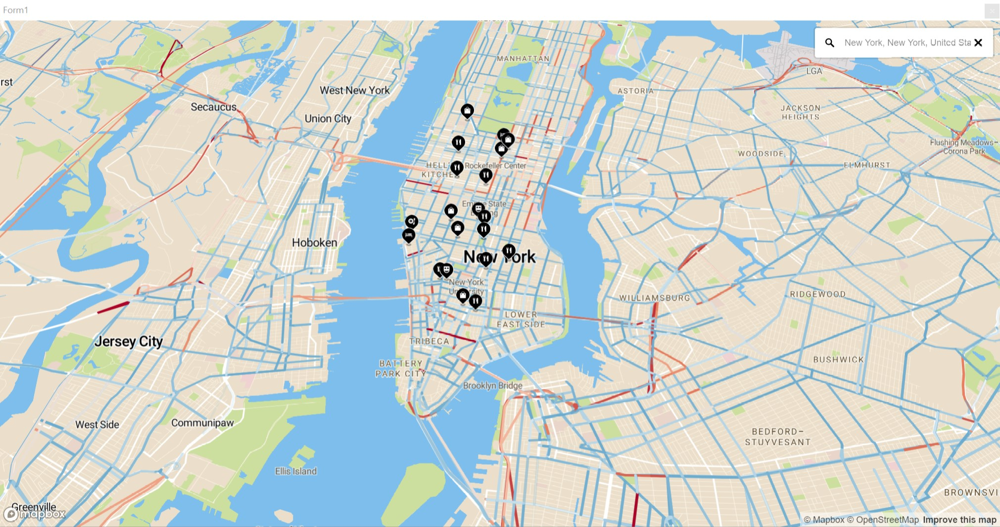
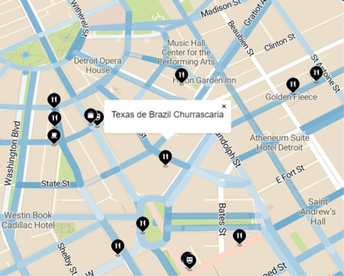
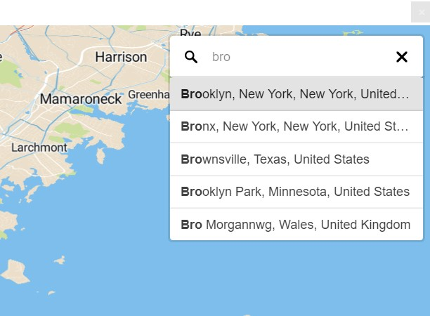

# WhatsHappeningHere
*What's Happening Here?* is a map-based web app designed to display live traffic data and points-of-interest markers in a local area.

## Getting Started
This section goes over how to install a working version of *What's Happening Here?* as well as how to get the source code to examine it in your own local IDE.

### Prerequisites
*What's Happening Here?* is designed with Microsoft Windows in mind and requires the .NET Framework version 4.0 to run.  Since it also uses CefSharp, it is currently only runnable on Windows.
Also, as a web app, it requires access to the internet.

#### But Do I Have .NET Framework 4.0 Installed?
If you are running Microsoft Windows and are unsure whether or not .NET Framework 4.0 is installed, you can easily check with a command prompt:
Open a command prompt. Search for `cmd` in the start menu and select `command prompt`.


Run the following command:
```
dir /b %windir%\Microsoft.NET\Framework\v4*
```
If anything like the following is displayed, then you have .NET Framework version 4.0 installed.
If not, you will have to install it.


#### Installing .NET Framework 4.0
You can download the installation media from the Microsoft Download Center:

[.NET Framework 4.0 download page](https://www.microsoft.com/en-us/download/details.aspx?id=17851)

Follow the instructions on that page. If you do not meet the system, software, and hardware requirements, then you unfortunately
cannot install .NET Framework 4.0

### Installation
This section covers how to install the application or download the source code.

#### Get the App
Download the [7z archive file on this repository](./WhatsHappeningHere/exeArch.7z) that contains the executable and the supporting files and libraries.

Extract the contents of the archive with [7zip](https://www.7-zip.org/download.html). Open the extracted folder and the subdirectory `Release` and run the executable file `WhatsHappeningHere.exe`.

#### Get the Source
Click `clone or download` and if Visual Studio is installed, you can click `Open in Visual Studio`.
Otherwise, select `Download ZIP`, extract the archive into a convenient location and once Visual Studio is installed, open `WhatsHappeningHere.sln` in Visual Studio.


## Using the App
This section previews some basic use of the *What's Happening Here?* app.

### Overview of the Visual Presentation


The colored lines painted over the roads indicate traffic flow.  This includes backups and closures (i.e. a gridlocked road looks the same as a completely closed road).  On the gradual spectrum of blue to red, blue is the most minor backup and red is the most severe backup (or closure).  A road that is uncolored either has no backup or no available traffic data currently.

All of the black markers with icons indicate local points of interest.  The icons indicate the sort of service/attraction provided by each specific point of interest.

When you move the map (either by dragging or zooming, or by using the geocoder search tool) the traffic and point of interest data are reloaded.

### Basic Interactions



You can click on a marker to view the name of the point of interest that it indicates.  Only one popup will be shown at a time, clicking an another popup closes any popup that is already open.

You can navigate the map by left-click-dragging to change location, scrolling to change zoom, and right-click-dragging to change the pitch (angle of the surface of the earth).


### Geocoder Search Tool



You can also jump to a location by searching it in the text field in the upper-right corner of the app. The geocoder search tool also supports search query completion by listing suggested results when a partial query is entered.  You can select any of the suggested results by clicking on it.


## Technologies Used
This section goes over the supporting libraries and technologies that make this app possible.

### Web Service APIs Used
[Mapbox](https://www.mapbox.com/) - For map that is the core of this app.
[Here APIs](https://developer.here.com/) - For the live traffic data as well as the points of interest data.

### Development Technologies Used
[CefSharp](https://cefsharp.github.io/) - CefSharp is the library used to embed the web browser into a Windows Form.
[RestSharp](http://restsharp.org/) - RestSharp was used for building organized and clear calls to the Web Service APIs.
[Newtonsoft Json.NET](https://www.newtonsoft.com/json) - Json.NET by Newtonsoft was used to handle the JSON response and request data.
[Visual Studio](https://visualstudio.microsoft.com/) - Visual Studio made for a streamlined development experience in designing this app.


### Languages Used in Development
The languages used were:
- C#
- HTML
- JavaScript
- CSS


### Data Formats Used for Web Service API Requests and Responses
The specific data formats that were used in API calls were:
- XML
- GeoJSON
- JSON (other non-mainstream schemas)
